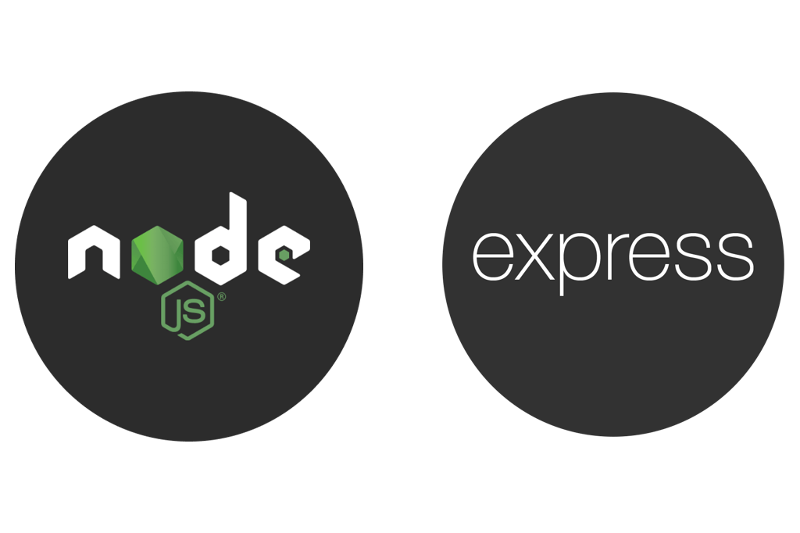

# **Guest Room Booking Application**

## **Project Title**

Guest Room Booking Application

## **Documentaion**
<button><a href="https://docs.google.com/document/d/1hkFgO48Wk71f2oDG2eUiBODznDWhBFVs/edit" style="padding:10px;backgroundColor:blue;color:white;border-radius:10px;">Documentaion</a> </button>
## **Introduction**

The Guest Room Booking Application is designed to facilitate the booking and management of guest rooms by house owners. It allows house owners to register their properties, manage room details, and handle bookings. Customers can browse available rooms, check availability, and book rooms for their stay.

The application uses React with Vite for the frontend, Express.js for the backend, and MongoDB as the database.
<!--       -->

 

## **Installation**

To install the Guest Room Booking Application, follow these steps:

### **Backend**

1. Clone the repository: `git clone https://github.com/mahaprabusivasamy/guest-room-booking-backend.git`
2. Navigate to the project directory: `cd guest-room-booking-backend`
3. Install dependencies: `npm install`
4. Set up the environment variables: Create a `.env` file and add the necessary environment variables (e.g., MongoDB connection string).
5. Start the backend server: `npm start`

### **Frontend**

1. Clone the repository: `git clone https://github.com/username/guest-room-booking-frontend.git`
2. Navigate to the project directory: `cd guest-room-booking-frontend`
3. Install dependencies: `npm install`
4. Start the frontend development server: `npm run dev`

## **Usage**

To use the Guest Room Booking Application, follow these steps:

1. Open the project in your favorite code editor.
2. Modify the source code to fit your needs.
3. Build the frontend project: `npm run build`
4. Start the backend server: `npm start`
5. Use the application by navigating to `http://localhost:5173` in your web browser.

## **Images**

1. HomePage
.png>)

2. Owner Login
.png>)

3. Owner Registration
.png>)

4. Customer Login
.png>)

5. Customer Registration
.png>)

6. Owner DashBoard
(Room Creation)
.png>)

 (Room creation sucessfully)
.png>)

(created rooms)

.png>)

(Edit the room details)
.png>)

(delete the romm details)
.png>)

8. Booking Page

(Room details after click book button)
.png>)

(once again get the user details - for verification )
(check validation of details given)
.png>)

(edit option to change the details or submit to xonfirm the details)
.png>)

(booking alert)
.png>)

(booked succesfully)
-1.png>)

(Bill is downloaded and automatically redirect to home page)
.png>)

(Bill)
.png>)

## **Authors and Acknowledgment**

The Guest Room Booking Application was created by Mahaprabu S(https://github.com/mahaprabusivasamy).
